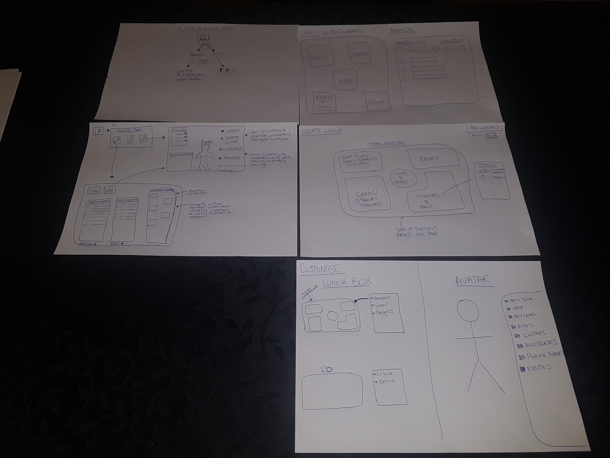
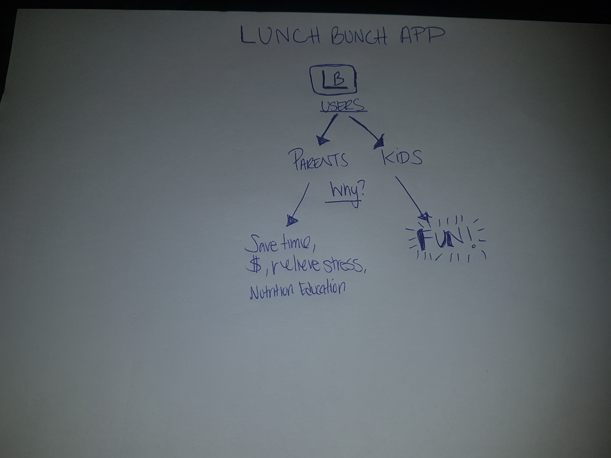
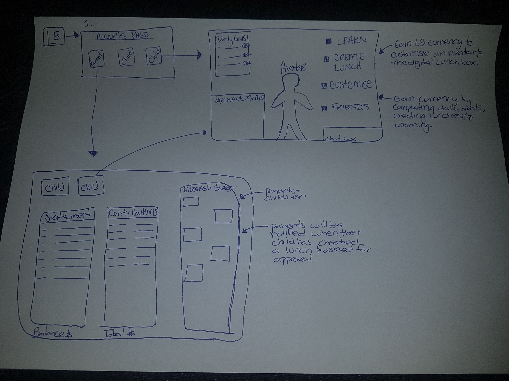
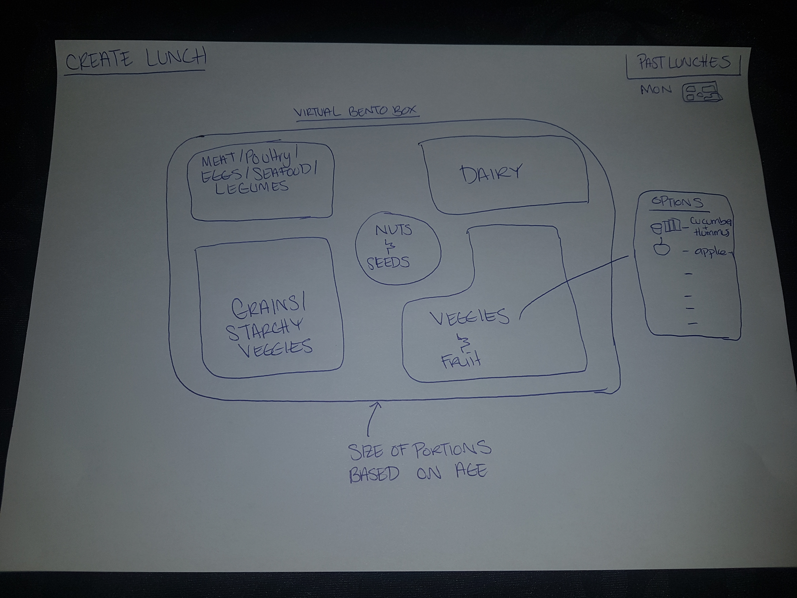
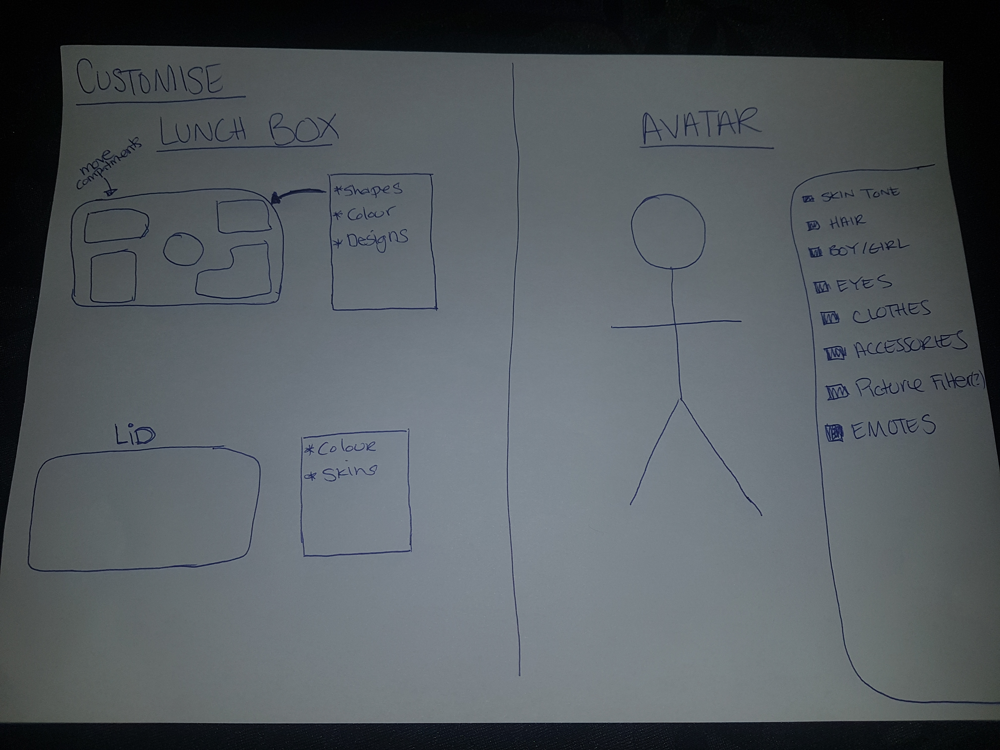

# Lunch Bunch 

> EDA Pac. Hack

We are Lunch Bunch NZ! We came 2nd place at the Auckland Pasifika Start Up Weekend with our idea to use technology to teach children and families nutrition education in a fun and engaging way through an app. Through the app children and parents can create healthy lunches while at the same time learning about nutrition in a fun way. Stress and guilt are then taken off parents as lunches are delivered to their child’s school.

Those using the app will be able to use a link to share on social media for Fanau & those in the community who wish to contribute to children’s lunches. We are also aware of the many children who go to school without a lunch and we would like to give back as well. We believe that this is an old problem that needs to be solved in a new way using technology to empower children and families and to help them gain the nutrition education they need as well as to work together with family and others in the community to make it more affordable.
--Roselene Walker   


## Contents
- [Team](#the-team)  
- [Routes](#routes)  
- [WireFrames](#wireframes)  


## The Team
**Product Owner**  
Roselene Walker  

**Dev Lead**  
Rich Churcher [@richchurcher](https://github.com/richchurcher)  

**Dev Team**  
Aimee Coxhead [@aimee_c_nikau](https://github.com/aimee-coxhead)  
Tom Hall [@tommy-hall](https://github.com/tommy-hall)  
Lauren Hart [@lauren_h_nikau](https://github.com/lauren-hart)  
James Built [@james_b_nikau](https://github.com/james-built)  
Amy Han [@amy_h_nikau](https://github.com/amy-han)  

**Assisted By**  
Emily Parkes [@emilyparkes](https://github.com/emilyparkes)  


## Routes

(all preceded by /api/v1)

### POST /auth/register

```
REGISTER_PENDING
REGISTER
REGISTER_ERROR
```

### POST /auth/login

```
LOGIN_PENDING
LOGIN
LOGIN_ERROR
```

### GET auth/logout

```
LOGOUT_PENDING
LOGOUT
LOGOUT_ERROR
```

### GET lunchboxes
### GET lunchboxes/:id

Should these return the lunchboxes for the current user? Should we use the same actions to get one lunchbox that we use to get a list of them?

```
GET_LUNCHBOXES_PENDING
GET_LUNCHBOXES
GET_LUNCHBOXES_ERROR
```

### POST lunchboxes

```
CREATE_LUNCHBOX_PENDING
CREATE_LUNCHBOX
CREATE_LUNCHBOX_ERROR
```

## PUT lunchboxes/:id

```
UPDATE_LUNCHBOX_PENDING
UPDATE_LUNCHBOX
UPDATE_LUNCHBOX_ERROR
```

## DELETE lunchboxes/:id

```
DELETE_LUNCHBOX_PENDING
DELETE_LUNCHBOX
DELETE_LUNCHBOX_ERROR
```

## WireFrames







